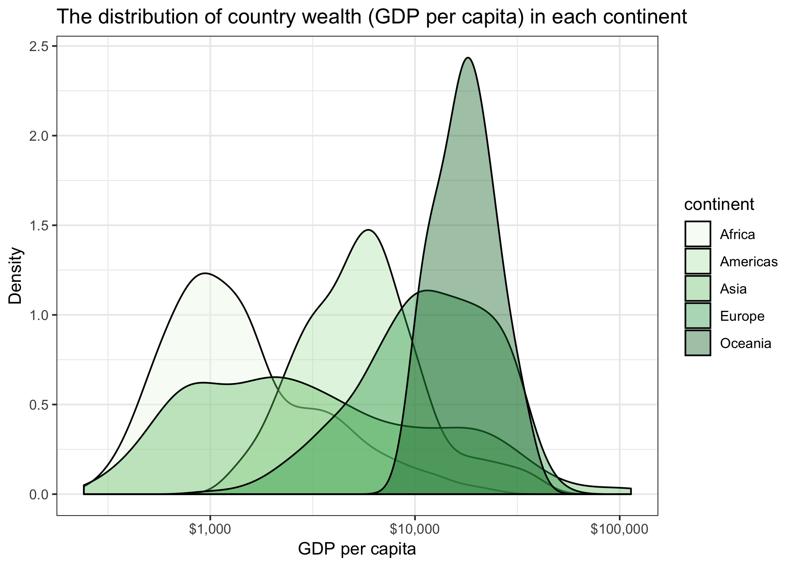

## Import libraries

```{r}
suppressPackageStartupMessages(library(gapminder))
suppressPackageStartupMessages(library(tidyverse))
suppressPackageStartupMessages(library(ggplot2))
suppressPackageStartupMessages(library(scales))
suppressPackageStartupMessages(library(plotly))
```

## Part 1: Factor management

### Drop Oceania

There are currently 5 continent levels of gapminder
```{r}
levels(gapminder$continent)
```

```{r}
gapminder_filtered = gapminder %>%
  filter(continent != "Oceania") %>%
  droplevels()
levels(gapminder_filtered$continent)
```

Now there are 4 levels after dropping filtering out Oceania, and dropping the unused level for Oceania.

### Reorder the levels of `continent`

Let's reorder the levels of the continents from `gapminder` by `gdpPercap`.

```{r}
continents <- gapminder$continent
reordered_continents = continents %>%
  fct_reorder(gapminder$gdpPercap, max)
levels(reordered_continents)
```

### Exploring how `arrange` affects the data and figures

First, let's create a smaller dataset to do this work on, so the visualizations and work can be seen better.

```{r}
gapminder_small = gapminder %>%
  select(country, year, gdpPercap) %>%
  filter(country %in% c('Turkey', 'United States', 'Canada')) %>%
  filter(year %% 2 == 1) %>%
  droplevels
str(gapminder_small)
```

#### Using `forcats`

```{r}
# using forcats
gapminder_reorder = gapminder_small %>%
  mutate(country = fct_reorder(country, gdpPercap))
knitr::kable(gapminder_reorder)
```

```{r}
gapminder_reorder %>% 
  ggplot(aes(year, gdpPercap, colour = country)) + 
  geom_point() +
  geom_line() + 
  theme_bw() +
  ggtitle("Using reordering for GDP per capita vs year")
```

### Using `arrange`

```{r}
# using arrange
gapminder_arrange = gapminder_small %>%
  group_by(country) %>%
  arrange(gdpPercap)
knitr::kable(gapminder_arrange)
```

```{r}
gapminder_arrange %>% 
  ggplot(aes(year, gdpPercap, colour = country)) + 
  geom_point() +
  geom_line() + 
  theme_bw() +
  ggtitle("Using arrange for GDP per capita vs year")
```

Note how the ordering of `country` in the legend changes depending on whether `arrange` or `forcats` is used.

## Part 2: File IO

Let's use the reordered small `gapminder` dataset from the last task, since the country levels have been ordered by `gdpPercap` instead of just alphabetical order.

```{r}
levels(gapminder_reorder$country)
```

```{r}
write.csv(gapminder_reorder, 'gapminder_reorder.csv')
gapminder_reorder_reread = read_csv('gapminder_reorder.csv')
```


```{r}
levels(as.factor(gapminder_reorder_reread$country))
```

The ordering of the levels has changed back to alphabetical order in the imported csv file!

Let's try the same thing with RDS this time.

```{r}
saveRDS(gapminder_reorder, 'gapminder_reorder.csv')
gapminder_reorder_reread = readRDS('gapminder_reorder.csv')
```

```{r}
levels(as.factor(gapminder_reorder_reread$country))
```

Interestingly, when RDS is used instead, the ordering of the levels is preserved.

## Part 3: Visualization design

The below plot is from Homework 03. I'm going to improve on it with the latest visualization tools we learned.

```{r}
gapminder %>%
  ggplot(aes(gdpPercap)) +
  scale_x_log10() +
  geom_density() +
  facet_wrap(~ continent)
```

```{r}
plot = (gapminder %>%
  ggplot(aes(gdpPercap, fill=continent)) +
  scale_x_log10(labels=dollar_format()) +
  geom_density(alpha=0.4) +
  scale_fill_brewer(palette = "Greens") +
  labs(x = "GDP per capita",
       y = "Density",
       title = "The distribution of country wealth (GDP per capita) in each continent")) +
  theme_bw()
plot
```

Let's see this in plotly

```{r}
plot %>%
  ggplotly() %>%
  htmlwidgets::saveWidget('wealth_dist_widget.html')
```

The graphical interface makes the graph much more interactive! We can use this to find specific information on the values of a specific data point, zoom in to a specific part of the graph, and create a .png file from any transformations we do within the interface.

## Part 4: Writing figures to file

```{r}
ggsave(plot, filename = 'images/wealth_dist.png', device = 'png')
ggsave(plot, filename = 'images/wealth_dist.jpg', device = 'jpg')
ggsave(plot, filename = 'images/wealth_dist.pdf', device = 'pdf')
```


