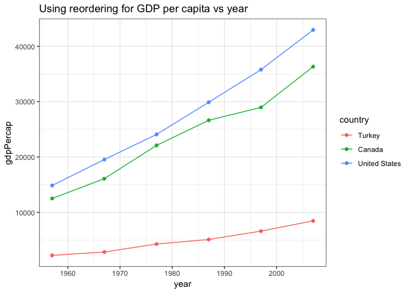
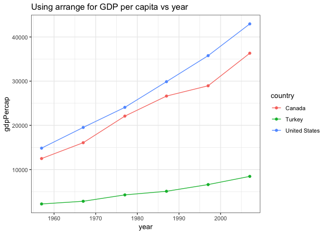
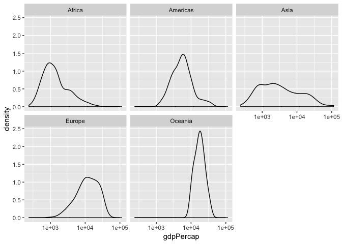
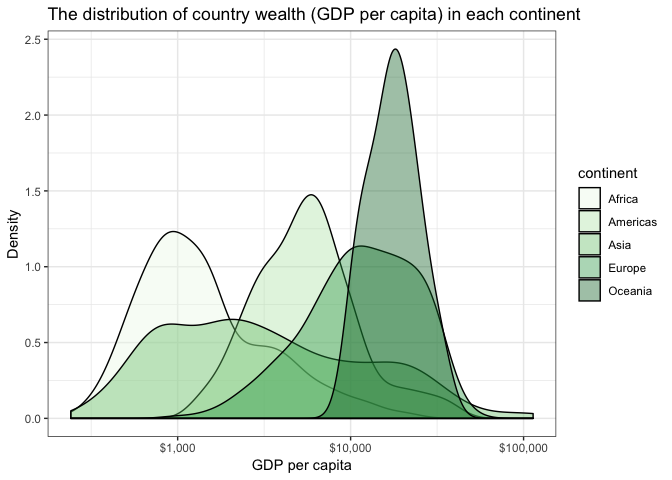

Homework 05: Factor and figure management
================
Emre Erhan
2018-10-01

## Import libraries

``` r
suppressPackageStartupMessages(library(gapminder))
suppressPackageStartupMessages(library(tidyverse))
suppressPackageStartupMessages(library(ggplot2))
suppressPackageStartupMessages(library(scales))
suppressPackageStartupMessages(library(plotly))
```

## Part 1: Factor management

### Drop Oceania

There are currently 5 continent levels of gapminder

``` r
levels(gapminder$continent)
```

    ## [1] "Africa"   "Americas" "Asia"     "Europe"   "Oceania"

``` r
gapminder_filtered = gapminder %>%
  filter(continent != "Oceania") %>%
  droplevels()
levels(gapminder_filtered$continent)
```

    ## [1] "Africa"   "Americas" "Asia"     "Europe"

Now there are 4 levels after dropping filtering out Oceania, and
dropping the unused level for Oceania.

### Reorder the levels of `continent`

Let’s reorder the levels of the continents from `gapminder` by
`gdpPercap`.

``` r
continents <- gapminder$continent
reordered_continents = continents %>%
  fct_reorder(gapminder$gdpPercap, max)
levels(reordered_continents)
```

    ## [1] "Africa"   "Oceania"  "Americas" "Europe"   "Asia"

### Exploring how `arrange` affects the data and figures

First, let’s create a smaller dataset to do this work on, so the
visualizations and work can be seen better.

``` r
gapminder_small = gapminder %>%
  select(country, year, gdpPercap) %>%
  filter(country %in% c('Turkey', 'United States', 'Canada')) %>%
  filter(year %% 2 == 1) %>%
  droplevels
str(gapminder_small)
```

    ## Classes 'tbl_df', 'tbl' and 'data.frame':    18 obs. of  3 variables:
    ##  $ country  : Factor w/ 3 levels "Canada","Turkey",..: 1 1 1 1 1 1 2 2 2 2 ...
    ##  $ year     : int  1957 1967 1977 1987 1997 2007 1957 1967 1977 1987 ...
    ##  $ gdpPercap: num  12490 16077 22091 26627 28955 ...

#### Using `forcats`

``` r
# using forcats
gapminder_reorder = gapminder_small %>%
  mutate(country = fct_reorder(country, gdpPercap))
knitr::kable(gapminder_reorder)
```

| country       | year | gdpPercap |
| :------------ | ---: | --------: |
| Canada        | 1957 | 12489.950 |
| Canada        | 1967 | 16076.588 |
| Canada        | 1977 | 22090.883 |
| Canada        | 1987 | 26626.515 |
| Canada        | 1997 | 28954.926 |
| Canada        | 2007 | 36319.235 |
| Turkey        | 1957 |  2218.754 |
| Turkey        | 1967 |  2826.356 |
| Turkey        | 1977 |  4269.122 |
| Turkey        | 1987 |  5089.044 |
| Turkey        | 1997 |  6601.430 |
| Turkey        | 2007 |  8458.276 |
| United States | 1957 | 14847.127 |
| United States | 1967 | 19530.366 |
| United States | 1977 | 24072.632 |
| United States | 1987 | 29884.350 |
| United States | 1997 | 35767.433 |
| United States | 2007 | 42951.653 |

``` r
gapminder_reorder %>% 
  ggplot(aes(year, gdpPercap, colour = country)) + 
  geom_point() +
  geom_line() + 
  theme_bw() +
  ggtitle("Using reordering for GDP per capita vs year")
```

<!-- -->

### Using `arrange`

``` r
# using arrange
gapminder_arrange = gapminder_small %>%
  group_by(country) %>%
  arrange(gdpPercap)
knitr::kable(gapminder_arrange)
```

| country       | year | gdpPercap |
| :------------ | ---: | --------: |
| Turkey        | 1957 |  2218.754 |
| Turkey        | 1967 |  2826.356 |
| Turkey        | 1977 |  4269.122 |
| Turkey        | 1987 |  5089.044 |
| Turkey        | 1997 |  6601.430 |
| Turkey        | 2007 |  8458.276 |
| Canada        | 1957 | 12489.950 |
| United States | 1957 | 14847.127 |
| Canada        | 1967 | 16076.588 |
| United States | 1967 | 19530.366 |
| Canada        | 1977 | 22090.883 |
| United States | 1977 | 24072.632 |
| Canada        | 1987 | 26626.515 |
| Canada        | 1997 | 28954.926 |
| United States | 1987 | 29884.350 |
| United States | 1997 | 35767.433 |
| Canada        | 2007 | 36319.235 |
| United States | 2007 | 42951.653 |

``` r
gapminder_arrange %>% 
  ggplot(aes(year, gdpPercap, colour = country)) + 
  geom_point() +
  geom_line() + 
  theme_bw() +
  ggtitle("Using arrange for GDP per capita vs year")
```

<!-- -->

Note how the ordering of `country` in the legend changes depending on
whether `arrange` or `forcats` is used.

## Part 2: File IO

Let’s use the reordered small `gapminder` dataset from the last task,
since the country levels have been ordered by `gdpPercap` instead of
just alphabetical order.

``` r
levels(gapminder_reorder$country)
```

    ## [1] "Turkey"        "Canada"        "United States"

``` r
write.csv(gapminder_reorder, 'gapminder_reorder.csv')
gapminder_reorder_reread = read_csv('gapminder_reorder.csv')
```

    ## Warning: Missing column names filled in: 'X1' [1]

    ## Parsed with column specification:
    ## cols(
    ##   X1 = col_integer(),
    ##   country = col_character(),
    ##   year = col_integer(),
    ##   gdpPercap = col_double()
    ## )

``` r
levels(as.factor(gapminder_reorder_reread$country))
```

    ## [1] "Canada"        "Turkey"        "United States"

The ordering of the levels has changed back to alphabetical order in the
imported csv file\!

Let’s try the same thing with RDS this time.

``` r
saveRDS(gapminder_reorder, 'gapminder_reorder.csv')
gapminder_reorder_reread = readRDS('gapminder_reorder.csv')
```

``` r
levels(as.factor(gapminder_reorder_reread$country))
```

    ## [1] "Turkey"        "Canada"        "United States"

Interestingly, when RDS is used instead, the ordering of the levels is
preserved.

## Part 3: Visualization design

The below plot is from Homework 03. I’m going to improve on it with the
latest visualization tools we learned.

``` r
gapminder %>%
  ggplot(aes(gdpPercap)) +
  scale_x_log10() +
  geom_density() +
  facet_wrap(~ continent)
```

<!-- -->

``` r
plot = (gapminder %>%
  ggplot(aes(gdpPercap, fill=continent)) +
  scale_x_log10(labels=dollar_format()) +
  geom_density(alpha=0.4) +
  scale_fill_brewer(palette = "Greens") +
  labs(x = "GDP per capita",
       y = "Density",
       title = "The distribution of country wealth (GDP per capita) in each continent")) +
  theme_bw()
plot
```

<!-- -->

Let’s see this in plotly

``` r
plot %>%
  ggplotly() %>%
  htmlwidgets::saveWidget('wealth_dist_widget.html')
```

The graphical interface makes the graph much more interactive\! We can
use this to find specific information on the values of a specific data
point, zoom in to a specific part of the graph, and create a .png file
from any transformations we do within the interface.

## Part 4: Writing figures to file

``` r
ggsave(plot, filename = 'images/wealth_dist.png', device = 'png')
```

    ## Saving 7 x 5 in image

``` r
ggsave(plot, filename = 'images/wealth_dist.jpg', device = 'jpg')
```

    ## Saving 7 x 5 in image

``` r
ggsave(plot, filename = 'images/wealth_dist.pdf', device = 'pdf')
```

    ## Saving 7 x 5 in image


